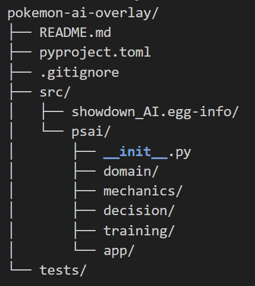

# Alright, first and foremost we need to confirm weve got the required installs ready:

## Run the following in your VS code bash terminal:
- python3 --version
    - If this gives an error, run: sudo apt update sudo apt install -y python3 python3-venv python3-pip
- git --version

## run these in ~/CptS440-PokemonAI/showdownAIproject$
- python3 -m venv .venv
- source .venv/bin/activate 

## run these in (.venv) 
- python -m pip install --upgrade pip wheel setuptools
- `pip install -e .` 

## SPECIFIC ROLES (choose one of these you want for now)
- Showdown Integration and State Parser
    - What you need to do here is get the data from the showdown browser with poke-env, and have a State object class that is updated every turn. State will have parameters like HP%, status, boosts, types, moves (for the enemy pokemon, only the ones that we have seen so far), item/ability if we know it.
    - We should have a State for friendlyPokemon and enemyPokemon, and this will update with each turn. 
    - track the different pokemon we have seen so far. Save a list of the existing pokemon in that battle.
    - DONE IF: given a live showdown battle, we can output a "state" showing the above information for each turn. 

- Mechanics Engine
    - This is the math engine essentially, that determines exactly what will happen if the selected move/choice is made. 
    - should output things like KO_probability which that uses the existing formulas to determine the % chance that a given move will kill the defender. 
    - other outputs would be things like move_order which just says who would attack first given each choice, and damage_done(attacker, defender, move, state)
    - Should match showdowns rules EXACTLY. this is where we could import that github repo mentioned in the essay to get the type tables and things like that.
    - DONE IF: we give it two pokemon and a move, we can output the expected damage and % chance it kills the defender. 

- Heuristic Search 1v1
    - This is the baseline 1v1 model (no machine learning, this one is just rules), which will use the heuristic scoring to decide moves.
        - Essentially, we want a function score(state) that can output a number that acts as the numeric "score" that state has. So a great state would be full health, type advantage and the enemy pokemon is almost dead. The higher the score, the better the state. 
        - We need to define the heuristtic terms, or the things that are actually checked when decided a score. Example scoring would be something like 
        if (ko_this_turn == true) score + 1000, if (get_koed_next_turn == true) score - 1000,
        score += 10 * expected_damage_percent, if (we_move_first == true) score + 100. 
        - for more examples, if (KO_probability >= 0.95) ko_this_turn == true. These probability and damage numbers would be coming from the mechanics engine. 
    - Once we have the ruleset, we would make a shallow search (similair thing to the one we use in the larger model) that will look 1-2 moves ahead, that will output the top 1-2 moves we could make based on the various different states those moves would generate.
    - output log, so we can see "in state x, model chose y" 
    - DONE IF: given a showdown 1v1, it consistently chooses decet moves and doesnt make obvious mistakes.

- Learning System
    - This is the "main" model. This is the policy+value network that we will train with the output logs from the heuristic 1v1's. 
    - Implement the actual MLP network. 
    - Build the training pipline, like dataset formats, and training metrics. 
    - Should be able to run self playing to let it keep learning.
    - DONE IF: Given the battle logs from the heuristic 1v1, it can then learn from these logs and essentially begin to decide and edit the manually made heuristic ruleset via training and studying the outcomes.

- Decision Engine
    - This is combining the mechanics engine with the learning system, essentially making all our different pieces work together. It should use the MLP policy to make a short list of even remotely decent moves/actions, then use the search to see the possible outcomes of those actions, then value to determine which of the possible search trees is our best bet and follows the next move in that tree before rerunning for the next step. 
    DONE IF: outputs a more structured output of the top 3 moves, and why. (MATHEMATICALLY, rather then as an LLM. I dont think we need that, but hey if someone wants to make this have an LLM included feel free as long as youre sure it would mess with things. )

- Overlay and Packaging
    - This is what turns all this other stuff into an actual downloadable application. needs art, needs to display the moves in a nice clean UI. Final step, but I think you can build on it from the getgo, just keeping in mind future needs. 
    - Needs proper packaging, so maybe something like Electron or Tauri. 
    - VERY IMPORTANT THAT WHOEVERS DOING THIS COORDINATES WITH THE INPUTS ROLE. The UI overlay and the showdown integration have to work together.
    - DONE IF: We can open a showdown 1v1, open the overlay, and get suggestions on the top 3 or so moves to play. 

## PRIMARY FILES TO WORK IN: 
- Showdown Integration and State Parser:
   - src/psai/domain/
   - src/psai/app/

- Mechanics Engine:
   - src/psa/mechanics/

- Heuristic Search 1v1:
   - src/psa/decision/
    
- Learning System:
   - src/psa/training/

- Decision Engine:
    - src/psa/decision/

- Overlay and Packaging:
   - src/psa/app/

## CURRENT FILE STRUCTURE EXPLANATION:
What we currently have:

First, domain/. This is just where we ask "what is the current game state" and output the answer. to other sections that use that outputed data for calculations.

Mechanics/ is the folder where we decide "what happens if we do x move". If we use the prexisting engine, we use api.py to do it.

Decision/ is "given current state, what move do we pick". Initially, we use heuristic.py and search.py to do the ruleset based decision making, then later use the data from training/ in decision.py to make the more complex predictions on moves. 

Training/ is where we actually "teach" the policy value network with the output logs we got from the baseline heuristic 1v1's. This is where the actual machine learning happens.

In app/, we create the actual UI and such later. for now just has main, which we use a dummy client to test things like making a false state and calling choose_action(state) and seeing what we get. 

So our "pipeline" is as such:

1. Integration gets browser data and builds a State object 
2. Decision chooser.py is called with the created State
3. chooser.py uses:
    - mechanics/api.py to determine actual damage/results of each indiviual move IN THAT STATE
    - either the heuristic ruleset or priority value to determine possible moves
    - search.py to look ahead for possible move outcomes, finding best "move trees"
4. chooser.py returns the top moves and their "scores"
5. UI displays the results as a neat little overlay!
